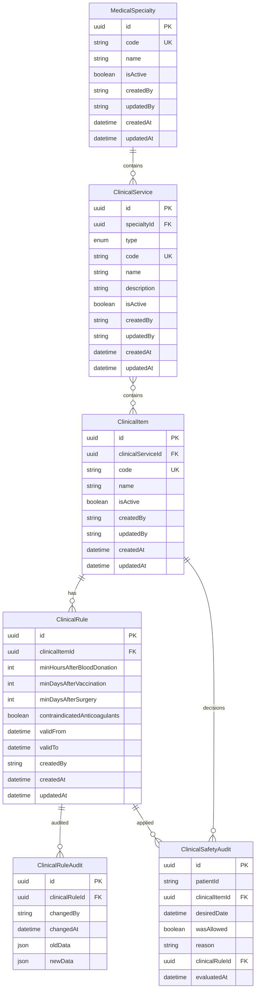
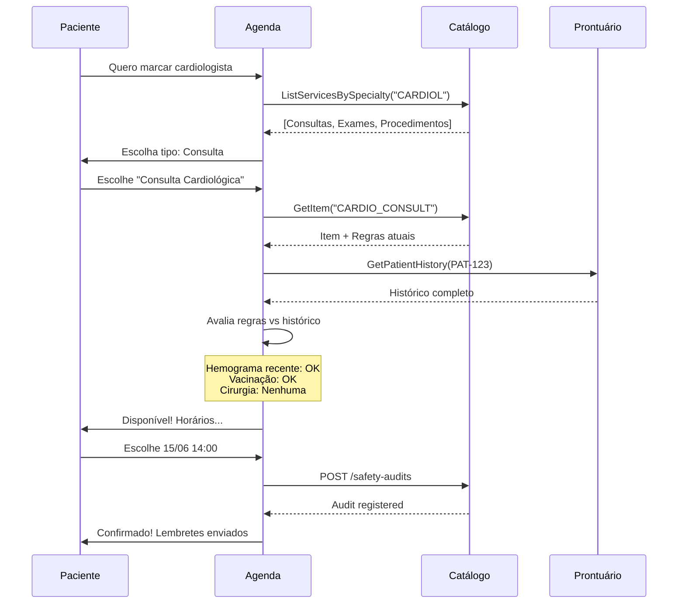
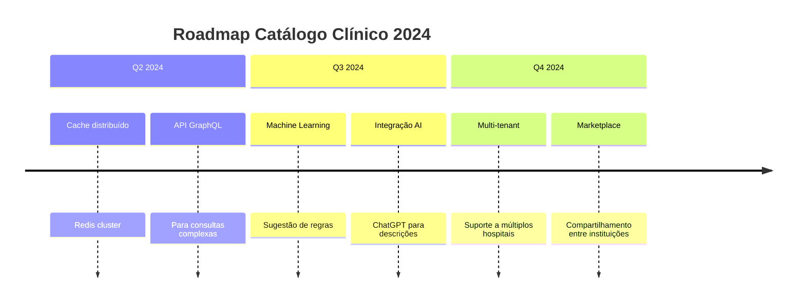

# **Catálogo Clínico: Guia de Implementação e Integração**

## **Sumário**
- [Introdução](#introducao)
- [Arquitetura do Sistema](#arquitetura-do-sistema)
- [Estrutura de Dados](#estrutura-de-dados)
- [APIs REST Completas](#apis-rest-completas)
- [APIs gRPC de Alto Desempenho](#apis-grpc-de-alto-desempenho)
- [Casos de Uso Reais](#casos-de-uso-reais)
- [Fluxos de Integração](#fluxos-de-integracao)
- [Segurança e Conformidade](#seguranca-e-conformidade)
- [Monitoramento](#monitoramento)
- [Troubleshooting](#troubleshooting)
- [FAQs](#faqs)

---

## **Introdução**

### **O Problema que Resolvemos**

Em um hospital moderno, múltiplos sistemas precisam saber:
1. **O que pode ser feito** (procedimentos disponíveis)
2. **Quando pode ser feito** (restrições temporais)
3. **Quem pode fazer** (especialidades necessárias)
4. **O que não pode ser feito juntos** (contraindicações)

**Exemplo Prático:** João, 45 anos, quer marcar:
- Hemograma (exame de sangue)
- Consulta cardiológica
- Vacina da gripe

**Sem o catálogo clínico:**
- Sistema de agenda não sabe sobre contraindicações
- Prontuário não sabe códigos corretos
- Faturamento não sabe valores
- Risco médico: João pode tomar vacina logo após doar sangue (perigoso!)

**Com o catálogo clínico:**
```
Sistema verifica automaticamente:
1. João doou sangue há 2 dias
   → Hemograma bloqueado (precisa 3 dias)
2. João tem hipertensão
   → Consulta cardiológica permitida
3. João não tem alergias
   → Vacina da gripe permitida

Resultado: Agenda só mostra o que é SEGURO
```

### **O que Este Documento Cobre**

Este guia é para:
- **Desenvolvedores** que vão integrar com o sistema
- **Administradores** que vão configurar o catálogo
- **Analistas** que vão criar regras de negócio
- **Gestores** que precisam entender capacidades

---

## **Arquitetura do Sistema**

### **Visão Geral**

```
┌─────────────────────────────────────────────────────────┐
│                    Outros Sistemas                       │
│  (Agenda, Prontuário, Faturamento, Laboratório)         │
└───────────────┬─────────────────┬───────────────────────┘
                │                 │
          ┌─────▼─────┐     ┌─────▼─────┐
          │   gRPC    │     │    REST   │
          │ (Leitura) │     │ (CRUD)    │
          └─────┬─────┘     └─────┬─────┘
                │                 │
        ┌───────▼─────────────────▼───────┐
        │    Catálogo Clínico (NestJS)    │
        │ ┌─────────────────────────────┐ │
        │ │ • Especialidades           │ │
        │ │ • Serviços Clínicos        │ │
        │ │ • Itens Clínicos           │ │
        │ │ • Regras Clínicas          │ │
        │ │ • Auditoria                │ │
        │ └─────────────────────────────┘ │
        └───────┬─────────────────────────┘
                │
        ┌───────▼─────────────────────────┐
        │        PostgreSQL               │
        │  (com Prisma ORM)              │
        └─────────────────────────────────┘
```

### **Princípios de Design**

1. **Separação de Responsabilidades**
   - REST para **administração** (CRUD)
   - gRPC para **consulta** (alta performance)

2. **Imutabilidade**
   - Regras nunca são editadas, são versionadas
   - Histórico completo de mudanças

3. **Integridade Referencial**
   ```typescript
   // Não pode deletar se há dependentes
   Especialidade → Tem serviços? Não deleta
   Serviço → Tem itens? Não deleta
   Item → Tem regras? Não deleta
   ```

4. **Auditoria Completa**
   ```json
   {
     "who": "sistema@hospital.com",
     "when": "2024-01-15T10:30:00Z",
     "what": "Consulta regra HEMOGRAM",
     "result": "BLOQUEADO",
     "reason": "Doação de sangue recente"
   }
   ```

---

## **Estrutura de Dados**

### **Diagrama Entidade-Relacionamento**



### **Descrição Detalhada das Tabelas**

#### **1. MedicalSpecialty (Especialidades)**

| Campo | Tipo | Obrigatório | Descrição | Exemplo |
|-------|------|-------------|-----------|---------|
| `id` | UUID | Sim | Identificador único | `123e4567-e89b-12d3-a456-426614174000` |
| `code` | String | Sim | Código único (3-10 chars) | `CARDIOL` |
| `name` | String | Sim | Nome da especialidade | `Cardiologia` |
| `isActive` | Boolean | Não (default: true) | Se está ativa | `true` |
| `createdBy` | String | Não (default: "system") | Quem criou | `admin@hospital.com` |
| `updatedBy` | String | Não (default: "system") | Quem atualizou | `admin@hospital.com` |

**Índices:**
- `code` (único)
- `isActive` (para filtros)

#### **2. ClinicalService (Serviços Clínicos)**

| Campo | Tipo | Valores | Descrição |
|-------|------|---------|-----------|
| `type` | Enum | `CONSULTATION`, `EXAM`, `VACCINE`, `PROCEDURE` | Tipo do serviço |

**Exemplo de uso correto:**
```json
{
  "type": "EXAM",  // CORRETO
  "name": "Exames Laboratoriais",
  "description": "Coleta e análise de amostras"
}

{
  "type": "VACCINE",  // CORRETO
  "name": "Serviço de Vacinação",
  "description": "Aplicação de vacinas"
}

// ERRADO
{
  "type": "Exame",  // Português
  "type": "vacina", // Minúsculo
  "type": "CONSULTA" // Português
}
```

#### **3. ClinicalItem (Itens Clínicos)**

**Exemplos reais com códigos:**

| Item | Código | Tipo | Descrição |
|------|--------|------|-----------|
| Hemograma | `HEMOGRAM_COMPLETE` | EXAM | Análise sanguínea |
| Eletrocardiograma | `ECG_12_LEADS` | EXAM | Exame cardíaco |
| Vacina COVID-19 | `COVID19_VAC_MRNA` | VACCINE | Imunização |
| Consulta cardiológica | `CARDIO_CONSULT_FIRST` | CONSULTATION | Avaliação inicial |
| Cirurgia de apêndice | `APPENDECTOMY_LAP` | PROCEDURE | Remoção laparoscópica |

#### **4. ClinicalRule (Regras Clínicas)**

**Significado clínico dos campos:**

| Campo | Significado Médico | Exemplo Clínico |
|-------|-------------------|-----------------|
| `minHoursAfterBloodDonation` | Tempo mínimo após doação de sangue | 72h = 3 dias (para evitar anemia) |
| `minDaysAfterVaccination` | Tempo mínimo após vacinação | 7d = 1 semana (evitar reações) |
| `minDaysAfterSurgery` | Tempo mínimo após cirurgia | 30d = 1 mês (cicatrização) |
| `contraindicatedAnticoagulants` | Riscos com anticoagulantes | true = PROIBIDO com varfarina |

**Exemplo de regra complexa:**
```json
{
  "clinicalItemId": "MAJOR_SURGERY",
  "minHoursAfterBloodDonation": 168,  // 7 dias
  "minDaysAfterVaccination": 30,      // 1 mês
  "minDaysAfterSurgery": 90,          // 3 meses
  "contraindicatedAnticoagulants": true,
  "validFrom": "2024-01-01T00:00:00Z",
  "createdBy": "comite.seguranca@hospital.com",
  "medicalRationale": "Cirurgias maiores requerem estabilidade hemodinâmica completa. Anticoagulantes aumentam risco de sangramento em 300%."
}
```

---

## **APIs REST Completas**

### **Base URL e Autenticação**

```bash
# Ambiente de Desenvolvimento
BASE_URL = http://localhost:3000

# Produção  
BASE_URL = https://api.hospital.com/catalogo

# Headers obrigatórios
Content-Type: application/json
Authorization: Bearer <jwt-token>
X-Hospital-Id: <hospital-id>
```

### **1. Especialidades Médicas**

#### **1.1 Criar Especialidade**

```bash
POST /specialties
```

**Payload:**
```json
{
  "code": "NEUROLOG",  // Maiúsculas, único
  "name": "Neurologia",
  "description": "Especialidade responsável por doenças do sistema nervoso",
  "isActive": true
}
```

**Resposta (201 Created):**
```json
{
  "id": "550e8400-e29b-41d4-a716-446655440000",
  "code": "NEUROLOG",
  "name": "Neurologia",
  "description": "Especialidade responsável por doenças do sistema nervoso",
  "isActive": true,
  "createdBy": "admin@hospital.com",
  "updatedBy": "admin@hospital.com",
  "createdAt": "2024-01-15T10:30:00.000Z",
  "updatedAt": "2024-01-15T10:30:00.000Z",
  "_links": {
    "self": "/specialties/550e8400-e29b-41d4-a716-446655440000",
    "services": "/services?specialtyId=550e8400-e29b-41d4-a716-446655440000"
  }
}
```

**Erros Comuns:**
```json
// Código já existe
{
  "statusCode": 409,
  "message": "Specialty with code 'NEUROLOG' already exists",
  "error": "Conflict"
}

// Código inválido
{
  "statusCode": 400,
  "message": [
    "code must contain only uppercase letters, numbers and underscores"
  ]
}
```

#### **1.2 Listar Especialidades com Filtros**

```bash
GET /specialties?search=cardio&isActive=true&page=1&limit=20
```

**Parâmetros de Query:**

| Parâmetro | Tipo | Default | Descrição |
|-----------|------|---------|-----------|
| `search` | string | - | Busca em `code` e `name` |
| `isActive` | boolean | - | Filtra por status |
| `page` | number | 1 | Paginação |
| `limit` | number | 50 | Itens por página (max: 1000) |

**Resposta (200 OK):**
```json
{
  "data": [
    {
      "id": "550e8400-e29b-41d4-a716-446655440000",
      "code": "CARDIOL",
      "name": "Cardiologia",
      "isActive": true,
      "serviceCount": 15,
      "createdAt": "2024-01-10T08:00:00.000Z",
      "updatedAt": "2024-01-14T14:30:00.000Z"
    }
  ],
  "meta": {
    "total": 25,
    "page": 1,
    "limit": 20,
    "totalPages": 2,
    "hasNext": true,
    "hasPrev": false
  }
}
```

#### **1.3 Verificar se Pode Deletar**

```bash
GET /specialties/{id}/can-delete
```

**Resposta:**
```json
{
  "canDelete": false,
  "reason": "Specialty has 3 associated clinical services",
  "serviceCount": 3,
  "services": [
    {
      "id": "123e4567-e89b-12d3-a456-426614174000",
      "code": "CARD_CONSULT",
      "name": "Consultas Cardiológicas"
    }
  ],
  "recommendation": "Desative a especialidade (isActive=false) em vez de deletar"
}
```

#### **1.4 Desativar Especialidade**

```bash
PATCH /specialties/{id}
```

```json
{
  "isActive": false,
  "deactivationReason": "Fusão com departamento de Medicina Interna",
  "deactivatedBy": "diretor.medico@hospital.com",
  "deactivatedAt": "2024-06-01T00:00:00.000Z"
}
```

**Efeito em cascata:**
- Todos serviços desta especialidade são desativados
- Todos itens destes serviços são desativados
- Regras continuam válidas para histórico

### **2. Serviços Clínicos**

#### **2.1 Criar Serviço**

```bash
POST /services
```

**Payload:**
```json
{
  "code": "NEURO_EXAMS",  // Único no sistema
  "name": "Exames Neurológicos",
  "specialtyId": "550e8400-e29b-41d4-a716-446655440000",
  "type": "EXAM",  // Um dos: CONSULTATION, EXAM, VACCINE, PROCEDURE
  "description": "Exames de imagem e funcionais do sistema nervoso",
  "isActive": true,
  "metadata": {
    "averageDuration": 45,  // minutos
    "requiresFasting": true,
    "roomType": "imaging",
    "equipment": ["MRI", "EEG", "EMG"]
  }
}
```

**Validações:**
1. `specialtyId` deve existir e estar ativa
2. `code` deve ser único
3. `type` deve ser um dos 4 valores permitidos

#### **2.2 Buscar Serviços com Filtros Avançados**

```bash
# Busca complexa com múltiplos filtros
GET /services?specialtyId=550e8400-e29b-41d4-a716-446655440000&type=EXAM&isActive=true&search=neuro&page=1&limit=10
```

**Resposta com Dados Enriquecidos:**
```json
{
  "data": [
    {
      "id": "123e4567-e89b-12d3-a456-426614174000",
      "code": "NEURO_EXAMS",
      "name": "Exames Neurológicos",
      "type": "EXAM",
      "description": "Exames de imagem e funcionais do sistema nervoso",
      "isActive": true,
      "specialty": {
        "id": "550e8400-e29b-41d4-a716-446655440000",
        "code": "NEUROLOG",
        "name": "Neurologia"
      },
      "itemCount": 8,
      "createdAt": "2024-01-15T11:00:00.000Z",
      "metadata": {
        "averageDuration": 45,
        "requiresFasting": true
      }
    }
  ],
  "meta": {
    "total": 8,
    "page": 1,
    "limit": 10
  }
}
```

#### **2.3 Batch Request para Múltiplos Serviços**

```bash
# Quando a agenda precisa de vários serviços de uma vez
GET /services/batch?ids=id1,id2,id3,id4,id5

# Ou por especialidade
GET /services/batch?specialtyId=550e8400-e29b-41d4-a716-446655440000&isActive=true
```

**Cenário de uso:** A agenda carrega todos serviços de uma especialidade para montar a grade

### **3. Itens Clínicos**

#### **3.1 Criar Item com Validação em Tempo Real**

```bash
POST /items
```

**Exemplo 1: Criando um Exame**
```json
{
  "code": "MRI_BRAIN_W_CONTRAST",
  "name": "Ressonância Magnética Cerebral com Contraste",
  "clinicalServiceId": "123e4567-e89b-12d3-a456-426614174000",
  "description": "Exame de imagem para avaliar cérebro com contraste gadolínio",
  "metadata": {
    "cptCode": "70553",
    "tussCode": "31001079",
    "duration": 60,
    "preparation": [
      "Jejum de 4 horas",
      "Suspender metformina 48h antes",
      "Trazer exames anteriores"
    ],
    "contraindications": [
      "Gestantes",
      "Insuficiência renal",
      "Alergia a gadolínio"
    ]
  }
}
```

**Exemplo 2: Criando uma Vacina**
```json
{
  "code": "INFLUENZA_VAC_2024",
  "name": "Vacina Influenza 2024 (Gripe)",
  "clinicalServiceId": "456e7890-f12c-34d5-b678-567812345678",
  "description": "Vacina tetravalente contra influenza para temporada 2024",
  "metadata": {
    "manufacturer": "Sanofi",
    "lotNumber": "FLU2024-001",
    "administrationRoute": "intramuscular",
    "ageRange": ">6 meses",
    "storage": "2-8°C",
    "validity": "2024-12-31"
  }
}
```

#### **3.2 Buscar Itens com Regras Atuais**

```bash
GET /items/{id}?includeRules=true
```

**Resposta Completa:**
```json
{
  "id": "789a0123-b45c-67d8-e901-234567890123",
  "code": "MRI_BRAIN_W_CONTRAST",
  "name": "Ressonância Magnética Cerebral com Contraste",
  "isActive": true,
  "clinicalService": {
    "id": "123e4567-e89b-12d3-a456-426614174000",
    "code": "NEURO_EXAMS",
    "name": "Exames Neurológicos",
    "type": "EXAM",
    "specialty": {
      "id": "550e8400-e29b-41d4-a716-446655440000",
      "code": "NEUROLOG",
      "name": "Neurologia"
    }
  },
  "currentRule": {
    "id": "901c2345-d67e-89f0-g123-456789012345",
    "minHoursAfterBloodDonation": 72,
    "minDaysAfterVaccination": 7,
    "minDaysAfterSurgery": 30,
    "contraindicatedAnticoagulants": true,
    "validFrom": "2024-01-01T00:00:00.000Z",
    "isCurrent": true,
    "medicalRationale": "Contraste pode causar nefropatia em pacientes com função renal comprometida"
  },
  "ruleHistory": [
    {
      "validFrom": "2023-01-01",
      "validTo": "2023-12-31",
      "minDaysAfterSurgery": 14
    }
  ],
  "safetyStats": {
    "totalEvaluations": 1245,
    "blockedCount": 23,
    "blockRate": "1.85%",
    "commonReasons": [
      "Função renal reduzida",
      "Alergia a contraste"
    ]
  }
}
```

#### **3.3 Buscar Todos os Itens de um Serviço**

```bash
GET /items?serviceId=123e4567-e89b-12d3-a456-426614174000&includeCurrentRules=true
```

**Cenário:** Laboratório quer todos exames disponíveis com suas regras

### **4. Regras Clínicas**

#### **4.1 Criar Regra com Validação de Sobreposição**

```bash
POST /rules
```

**Payload Completo:**
```json
{
  "clinicalItemId": "MRI_BRAIN_W_CONTRAST",
  "minHoursAfterBloodDonation": 72,
  "minDaysAfterVaccination": 7,
  "minDaysAfterSurgery": 30,
  "contraindicatedAnticoagulants": true,
  "validFrom": "2024-06-01T00:00:00.000Z",
  "validTo": "2024-12-31T23:59:59.999Z",
  "createdBy": "comite.radiologia@hospital.com",
  "approval": {
    "approvedBy": "dr.silva@hospital.com",
    "approvalDate": "2024-05-15T14:30:00.000Z",
    "protocolNumber": "PROT-2024-045"
  },
  "references": [
    {
      "type": "guideline",
      "title": "ACR Manual on Contrast Media",
      "version": "2024",
      "section": "5.2.1"
    }
  ],
  "exceptions": [
    {
      "condition": "Emergência neurológica",
      "action": "Proceder com monitoramento renal"
    }
  ]
}
```

**Validações Automáticas:**
1. Item clínico existe e está ativo
2. `validFrom` < `validTo` (se `validTo` fornecido)
3. Não sobrepõe regra existente no mesmo período
4. Todos campos numéricos >= 0

#### **4.2 Buscar Regras com Filtros Temporais**

```bash
# Buscar regras atuais de um item
GET /rules?itemId=MRI_BRAIN_W_CONTRAST&currentOnly=true

# Buscar regras válidas em uma data específica
GET /rules?itemId=MRI_BRAIN_W_CONTRAST&validAt=2024-07-15

# Buscar todas regras (histórico)
GET /rules?itemId=MRI_BRAIN_W_CONTRAST&page=1&limit=50
```

**Resposta com Timeline:**
```json
{
  "data": [
    {
      "id": "rule-2024",
      "validFrom": "2024-01-01T00:00:00.000Z",
      "validTo": null,
      "isCurrent": true,
      "createdBy": "comite.2024@hospital.com",
      "summary": "minDaysAfterSurgery: 30, anticoagulantes: contraindicado"
    },
    {
      "id": "rule-2023", 
      "validFrom": "2023-01-01T00:00:00.000Z",
      "validTo": "2023-12-31T23:59:59.999Z",
      "isCurrent": false,
      "createdBy": "comite.2023@hospital.com",
      "summary": "minDaysAfterSurgery: 14, anticoagulantes: requer avaliação"
    }
  ],
  "timeline": [
    {
      "period": "2023",
      "rule": "rule-2023",
      "minDaysAfterSurgery": 14
    },
    {
      "period": "2024→",
      "rule": "rule-2024", 
      "minDaysAfterSurgery": 30,
      "change": "Aumentado para 30 dias baseado em estudo recente"
    }
  ]
}
```

#### **4.3 Atualizar Regra (Criando Nova Versão)**

```bash
# NUNCA use PATCH em regra existente
# SEMPRE crie nova versão

POST /rules
{
  "clinicalItemId": "MRI_BRAIN_W_CONTRAST",
  "minHoursAfterBloodDonation": 96,  // Mudou de 72 para 96
  // ... outros campos
  "validFrom": "2024-07-01T00:00:00.000Z",  // Nova data de início
  "changeReason": "Novo estudo mostra necessidade de 96h após doação"
}
```

**Processo de Versionamento:**
1. Regra antiga: `validTo = 2024-06-30T23:59:59.999Z`
2. Regra nova: `validFrom = 2024-07-01T00:00:00.000Z`
3. Sistema mantém ambas para auditoria

#### **4.4 Auditoria de Regra**

```bash
GET /rules/{ruleId}/audit?page=1&limit=20
```

**Resposta de Auditoria:**
```json
{
  "rule": {
    "id": "rule-2024",
    "item": "MRI_BRAIN_W_CONTRAST",
    "currentValues": {
      "minDaysAfterSurgery": 30
    }
  },
  "auditTrail": [
    {
      "id": "audit-001",
      "changedAt": "2024-05-15T14:30:00.000Z",
      "changedBy": "dr.silva@hospital.com",
      "changeType": "RULE_CREATION",
      "details": "Regra criada conforme protocolo PROT-2024-045",
      "before": null,
      "after": {
        "minDaysAfterSurgery": 30
      }
    },
    {
      "id": "audit-002", 
      "changedAt": "2024-06-01T09:15:00.000Z",
      "changedBy": "system",
      "changeType": "RULE_APPLIED",
      "details": "Aplicada para paciente PAT-12345",
      "patientId": "PAT-12345",
      "wasAllowed": false,
      "reason": "Cirurgia recente (15 dias)"
    }
  ],
  "statistics": {
    "totalChanges": 15,
    "totalApplications": 1245,
    "blockRate": "2.3%"
  }
}
```

### **5. Auditoria de Segurança**

#### **5.1 Registrar Decisão de Segurança**

```bash
POST /rules/safety-audits
```

**Cenário:** Sistema de agenda consultou se pode marcar um exame

```json
{
  "patientId": "PAT-67890",
  "clinicalItemId": "MRI_BRAIN_W_CONTRAST",
  "desiredDate": "2024-06-15T14:00:00.000Z",
  "wasAllowed": false,
  "reason": "Paciente realizou cirurgia em 2024-05-20 (25 dias atrás). Regra requer 30 dias.",
  "clinicalRuleId": "rule-2024",
  "context": {
    "requestedBy": "agenda@hospital.com",
    "requestId": "REQ-2024-001234",
    "patientContext": {
      "age": 65,
      "conditions": ["hipertensao", "diabetes"],
      "currentMeds": ["varfarina", "metformina"]
    }
  }
}
```

#### **5.2 Consultar Histórico de Decisões**

```bash
GET /rules/safety-audits?patientId=PAT-67890&startDate=2024-01-01&endDate=2024-06-30
```

**Resposta Analítica:**
```json
{
  "patientId": "PAT-67890",
  "period": "2024-01-01 to 2024-06-30",
  "summary": {
    "totalRequests": 45,
    "allowed": 38,
    "blocked": 7,
    "blockRate": "15.6%"
  },
  "decisions": [
    {
      "date": "2024-06-15",
      "item": "MRI_BRAIN_W_CONTRAST",
      "wasAllowed": false,
      "reason": "Cirurgia recente",
      "ruleApplied": "rule-2024"
    },
    {
      "date": "2024-06-10",
      "item": "HEMOGRAM_COMPLETE",
      "wasAllowed": true,
      "ruleApplied": "rule-hemogram-2024"
    }
  ],
  "patterns": {
    "commonBlockReasons": [
      "Cirurgia recente (4x)",
      "Uso de anticoagulantes (3x)"
    ],
    "suggestions": [
      "Considerar ajuste medicação antes de procedimentos"
    ]
  }
}
```

---

## **APIs gRPC de Alto Desempenho**

### **Configuração do Serviço gRPC**

```protobuf
syntax = "proto3";

package clinical.catalog;

service ClinicalCatalogService {
  // ============ ESPECIALIDADES ============
  rpc ListSpecialties (SpecialtyFilter) returns (SpecialtyListResponse);
  rpc GetSpecialty (SpecialtyIdRequest) returns (SpecialtyResponse);
  
  // ============ SERVIÇOS ============
  rpc ListServices (ServiceFilter) returns (ServiceListResponse);
  rpc GetService (ServiceIdRequest) returns (ServiceResponse);
  rpc ListServicesBySpecialty (SpecialtyIdRequest) returns (ServiceListResponse);
  rpc BatchGetServices (BatchServiceRequest) returns (ServiceListResponse);
  
  // ============ ITENS ============
  rpc ListItems (ItemFilter) returns (ItemListResponse);
  rpc GetItem (ItemIdRequest) returns (ItemResponse);
  rpc ListItemsByService (ServiceIdRequest) returns (ItemListResponse);
  rpc BatchGetItems (BatchItemRequest) returns (ItemListResponse);
  
  // ============ REGRAS ============
  rpc ListRules (RuleFilter) returns (RuleListResponse);
  rpc GetRule (RuleIdRequest) returns (RuleResponse);
  rpc ListRulesByItem (ItemIdRequest) returns (RuleListResponse);
  rpc ListRulesByItems (BatchItemRequest) returns (RuleListResponse);
  rpc GetCurrentRuleByItem (ItemIdRequest) returns (RuleResponse);
  rpc BatchGetCurrentRules (BatchItemRequest) returns (RuleListResponse);
}
```

### **Configuração do Cliente**

```typescript
// Configuração no microserviço de Agenda
import { ClientGrpc, ClientsModule } from '@nestjs/microservices';

@Module({
  imports: [
    ClientsModule.register([
      {
        name: 'CATALOG_CLIENT',
        transport: Transport.GRPC,
        options: {
          package: 'clinical.catalog',
          protoPath: join(__dirname, 'clinical-catalog.proto'),
          url: 'catalog-service:50051',  // Service name no Kubernetes
        },
      },
    ]),
  ],
})
export class AgendaModule {}

// Injeção no serviço
@Injectable()
export class AgendaService {
  private catalogClient: ClientGrpc;
  
  constructor(@Inject('CATALOG_CLIENT') private client: ClientGrpc) {
    this.catalogClient = client.getService<ClinicalCatalogService>('ClinicalCatalogService');
  }
}
```

### **Cenários de Uso gRPC**

#### **Cenário 1: Agenda Carregando Grade de Serviços**

```typescript
// Quando usuário seleciona "Cardiologia" na agenda
async function loadSpecialtyServices(specialtyId: string) {
  const response = await this.catalogClient.listServicesBySpecialty({
    id: specialtyId
  }).toPromise();
  
  // Transforma para interface da agenda
  return response.services.map(service => ({
    id: service.id,
    name: service.name,
    type: service.type,
    duration: service.metadata?.averageDuration || 30,
    color: this.getColorByType(service.type)
  }));
}

// Performance: 1000 serviços em < 50ms
```

#### **Cenário 2: Verificação em Massa de Regras**

```typescript
// Antes de mostrar disponibilidade na agenda
async function checkMultipleItems(items: string[], patientId: string) {
  // Busca todas regras atuais de uma vez
  const rulesResponse = await this.catalogClient.batchGetCurrentRules({
    ids: items
  }).toPromise();
  
  // Aplica regras para o paciente específico
  const patientHistory = await this.getPatientHistory(patientId);
  
  return rulesResponse.rules.map(rule => {
    const canProceed = this.evaluateRule(rule, patientHistory);
    return {
      itemId: rule.clinical_item_id,
      itemName: rule.item_name,
      canProceed,
      restrictions: canProceed ? [] : this.getRestrictions(rule, patientHistory),
      nextAvailableDate: this.calculateNextAvailable(rule, patientHistory)
    };
  });
}

// Exemplo de resposta
[
  {
    "itemId": "HEMOGRAM_COMPLETE",
    "itemName": "Hemograma Completo",
    "canProceed": false,
    "restrictions": ["Doação de sangue em 2024-06-10"],
    "nextAvailableDate": "2024-06-13T00:00:00.000Z"
  }
]
```

#### **Cenário 3: Cache Warm-up no Startup**

```typescript
// Quando a agenda inicia, pré-carrega dados frequentes
async function warmUpCache() {
  // Carrega especialidades ativas
  const specialties = await this.catalogClient.listSpecialties({
    is_active: true,
    limit: 100
  }).toPromise();
  
  // Para cada especialidade, carrega serviços
  for (const specialty of specialties.specialties) {
    const services = await this.catalogClient.listServicesBySpecialty({
      id: specialty.id
    }).toPromise();
    
    this.cache.set(`specialty:${specialty.id}:services`, services, 3600);
  }
  
  // Carrega itens mais comuns
  const commonItems = ['HEMOGRAM', 'ECG', 'COVID_VAC'];
  const items = await this.catalogClient.batchGetItems({
    ids: commonItems
  }).toPromise();
  
  this.cache.set('common:items', items, 1800);
}
```

### **Métricas de Performance gRPC**

```typescript
// Middleware para medir performance
@Injectable()
export class CatalogMetricsInterceptor implements ClientInterceptor {
  intercept(
    call: ClientUnaryCall<any, any>,
    metadata: Metadata,
    next: CallHandler<any>
  ): Observable<any> {
    const startTime = Date.now();
    const method = call.getMethod();
    
    return next.handle().pipe(
      tap({
        next: () => {
          const duration = Date.now() - startTime;
          metrics.observeGrpcCall(method, duration, 'success');
        },
        error: (err) => {
          const duration = Date.now() - startTime;
          metrics.observeGrpcCall(method, duration, 'error');
        }
      })
    );
  }
}

// Métricas típicas esperadas
const expectedMetrics = {
  'GetSpecialty': { p95: '10ms', rps: 1000 },
  'ListServicesBySpecialty': { p95: '20ms', rps: 500 },
  'BatchGetCurrentRules': { p95: '50ms', rps: 200 }
};
```

---

## **Casos de Uso Reais**

### **Caso 1: Paciente com Múltiplas Condições**

**Paciente:** Maria, 68 anos
**Condições:** Diabetes, Hipertensão, Uso de Varfarina
**Deseja:** Hemograma + Consulta cardiológica

```typescript
// 1. Sistema agenda consulta regras
const rules = await catalogClient.batchGetCurrentRules({
  ids: ['HEMOGRAM_COMPLETE', 'CARDIO_CONSULT']
});

// 2. Avalia contra histórico
const evaluation = evaluatePatient(rules, {
  conditions: ['diabetes', 'hypertension'],
  medications: ['warfarin'],
  lastProcedures: [
    { type: 'blood_donation', date: '2024-06-01' },
    { type: 'vaccination', date: '2024-05-15' }
  ]
});

// 3. Resultado
const result = {
  hemogram: {
    allowed: false,
    reasons: [
      'Doação de sangue em 01/06/2024 (necessário 72h)',
      'Uso de varfarina (anticoagulante contraindicado)'
    ],
    alternatives: [
      'Aguardar até 04/06/2024',
      'Consultar hematologista para ajuste medicação'
    ]
  },
  cardioConsult: {
    allowed: true,
    warnings: [
      'Informar cardiologista sobre uso de varfarina',
      'Trazer último INR'
    ]
  }
};
```

### **Caso 2: Pré-Operatório Completo**

**Paciente:** João, 45 anos
**Cirurgia Agendada:** Apendicectomia (15/06/2024)
**Pré-Operatório Necessário:** ECG + Hemograma + Avaliação clínica

```typescript
// Sistema agenda verifica janela ideal
async function schedulePreOp(patientId: string, surgeryDate: Date) {
  const preOpItems = ['ECG_12_LEADS', 'HEMOGRAM_COMPLETE', 'CLINIC_EVAL'];
  
  // Busca regras de todos itens
  const rules = await catalogClient.batchGetCurrentRules({
    ids: preOpItems
  });
  
  // Calcula janelas ideais
  const windows = calculateWindows(rules, surgeryDate);
  
  return {
    idealSchedule: {
      'ECG': {
        date: addDays(surgeryDate, -7),
        reason: 'Necessário até 7 dias antes da cirurgia'
      },
      'Hemograma': {
        date: addDays(surgeryDate, -3),
        reason: 'Válido por 72h, necessário antes de suspender anticoagulantes'
      },
      'Avaliação Clínica': {
        date: addDays(surgeryDate, -1),
        reason: 'Última avaliação antes da cirurgia'
      }
    },
    contraindications: checkContraindications(rules, patientId),
    checklist: generatePreOpChecklist(rules)
  };
}
```

### **Caso 3: Vacinação em Lote**

**Cenário:** Campanha de vacinação contra influenza
**Pacientes:** 500 funcionários do hospital
**Logística:** Agendar em lotes considerando contraindicações

```typescript
async function batchVaccinationScheduling(patientIds: string[]) {
  const results = [];
  
  // Processa em lotes de 50
  for (let i = 0; i < patientIds.length; i += 50) {
    const batch = patientIds.slice(i, i + 50);
    
    // Para cada paciente, verifica regras da vacina
    const batchResults = await Promise.all(
      batch.map(async (patientId) => {
        const patient = await getPatient(patientId);
        const rule = await catalogClient.getCurrentRuleByItem({
          id: 'INFLUENZA_VAC_2024'
        });
        
        const canVaccinate = evaluateVaccinationRule(rule, patient);
        
        return {
          patientId,
          canVaccinate,
          reason: canVaccinate ? 'Apto' : getRestrictionReason(rule, patient),
          priority: calculatePriority(patient)
        };
      })
    );
    
    results.push(...batchResults);
  }
  
  // Agrupa resultados
  return {
    eligible: results.filter(r => r.canVaccinate),
    ineligible: results.filter(r => !r.canVaccinate),
    statistics: {
      total: results.length,
      eligibleCount: results.filter(r => r.canVaccinate).length,
      eligibilityRate: (results.filter(r => r.canVaccinate).length / results.length * 100).toFixed(1) + '%'
    }
  };
}
```

---

## **Fluxos de Integração**

### **Fluxo 1: Agendamento de Consulta**



### **Fluxo 2: Bloqueio Automático**

```typescript
// Quando paciente realiza um procedimento
async function recordProcedure(patientId: string, itemId: string, date: Date) {
  // 1. Registra no prontuário
  await prontuarioService.recordProcedure(patientId, itemId, date);
  
  // 2. Busca regras do procedimento realizado
  const rule = await catalogClient.getCurrentRuleByItem({ id: itemId });
  
  // 3. Identifica itens que serão bloqueados
  const blockedItems = await identifyBlockedItems(rule);
  
  // 4. Cria bloqueios na agenda
  for (const blockedItem of blockedItems) {
    await agendaService.createBlock(
      patientId,
      blockedItem.id,
      date,
      calculateBlockEndDate(date, rule, blockedItem)
    );
  }
  
  // 5. Notifica paciente
  await notifyPatient(patientId, {
    procedure: itemId,
    blockedItems: blockedItems.map(b => b.name),
    blockUntil: calculateBlockEndDate(date, rule, blockedItems[0])
  });
  
  return {
    procedureRecorded: true,
    blocksCreated: blockedItems.length,
    notificationSent: true
  };
}

// Exemplo: Doação de sangue bloqueia exames
const result = await recordProcedure(
  'PAT-123', 
  'BLOOD_DONATION', 
  new Date('2024-06-10')
);

console.log(result);
// {
//   procedureRecorded: true,
//   blocksCreated: 15,  // 15 tipos de exames bloqueados
//   notificationSent: true
// }
```

### **Fluxo 3: Auditoria Regulatória**

```typescript
// Para auditoria da ANVISA/CFM
async function generateRegulatoryReport(startDate: Date, endDate: Date) {
  // 1. Coleta todas decisões do período
  const audits = await catalogService.getSafetyAudits({
    startDate: startDate.toISOString(),
    endDate: endDate.toISOString(),
    limit: 10000
  });
  
  // 2. Agrupa por item e resultado
  const byItem = groupBy(audits.data, 'clinicalItemId');
  
  // 3. Gera estatísticas
  const report = {
    period: `${startDate.toISOString().split('T')[0]} to ${endDate.toISOString().split('T')[0]}`,
    totalDecisions: audits.meta.total,
    summary: {
      allowed: audits.data.filter(a => a.wasAllowed).length,
      blocked: audits.data.filter(a => !a.wasAllowed).length,
      blockRate: (audits.data.filter(a => !a.wasAllowed).length / audits.data.length * 100).toFixed(2) + '%'
    },
    items: Object.entries(byItem).map(([itemId, decisions]) => ({
      itemId,
      itemName: decisions[0].clinicalItem?.name || itemId,
      total: decisions.length,
      allowed: decisions.filter(d => d.wasAllowed).length,
      blocked: decisions.filter(d => !d.wasAllowed).length,
      commonReasons: getCommonReasons(decisions.filter(d => !d.wasAllowed))
    })),
    compliance: {
      rulesVersioned: await checkRulesVersioning(),
      auditTrailComplete: await checkAuditCompleteness(),
      responseTimes: await calculateResponseTimes()
    }
  };
  
  // 4. Gera PDF para auditoria
  const pdf = await generatePdfReport(report);
  
  return {
    report,
    pdf,
    generatedAt: new Date().toISOString(),
    generatedBy: 'audit.system@hospital.com'
  };
}
```

---

## **Segurança e Conformidade**

### **Controles de Acesso**

```typescript
// RBAC (Role-Based Access Control)
const roles = {
  ADMIN: {
    permissions: ['*'],
    description: 'Acesso completo ao catálogo'
  },
  CLINICAL_DIRECTOR: {
    permissions: [
      'specialties:read',
      'services:read',
      'items:read',
      'rules:create',
      'rules:update',
      'audit:read'
    ],
    description: 'Pode criar e modificar regras clínicas'
  },
  SCHEDULER: {
    permissions: [
      'specialties:read',
      'services:read', 
      'items:read',
      'rules:read',
      'safety-audits:create'
    ],
    description: 'Pode consultar catálogo e registrar decisões'
  },
  AUDITOR: {
    permissions: [
      'specialties:read',
      'services:read',
      'items:read',
      'rules:read',
      'audit:read',
      'safety-audits:read'
    ],
    description: 'Acesso somente leitura para auditoria'
  }
};
```

### **Logs de Segurança**

```json
{
  "timestamp": "2024-06-15T14:30:15.123Z",
  "level": "INFO",
  "service": "clinical-catalog",
  "event": "RULE_MODIFICATION",
  "user": {
    "id": "usr-12345",
    "email": "dr.silva@hospital.com",
    "role": "CLINICAL_DIRECTOR",
    "department": "Cardiologia"
  },
  "action": {
    "type": "RULE_CREATE",
    "target": {
      "itemId": "MRI_BRAIN_W_CONTRAST",
      "itemName": "Ressonância Cerebral com Contraste"
    },
    "changes": {
      "minDaysAfterSurgery": {
        "from": 14,
        "to": 30
      }
    },
    "reason": "Baseado em estudo JAMA 2024 sobre risco pós-cirúrgico",
    "approval": {
      "protocol": "PROT-2024-045",
      "approvedBy": "comite.etica@hospital.com"
    }
  },
  "context": {
    "ip": "192.168.1.100",
    "userAgent": "Mozilla/5.0...",
    "requestId": "req-67890"
  },
  "compliance": {
    "hipaaCompliant": true,
    "gdprCompliant": true,
    "retentionPeriod": "10 years"
  }
}
```

### **Backup e Recovery**

```yaml
# docker-compose.backup.yml
version: '3.8'
services:
  catalog-backup:
    image: postgres:15-alpine
    environment:
      PGHOST: catalog-db
      PGDATABASE: clinical_catalog
      PGUSER: backup_user
      PGPASSWORD: ${BACKUP_PASSWORD}
    volumes:
      - ./backups:/backups
    command: |
      sh -c '
        # Backup diário completo
        pg_dumpall -h $${PGHOST} -U $${PGUSER} > /backups/full-$(date +%Y%m%d).sql
        
        # Backup incremental de auditoria
        pg_dump -h $${PGHOST} -U $${PGUSER} -t clinical_safety_audits \
          --data-only --where="evaluated_at > NOW() - INTERVAL 1 DAY" \
          > /backups/audit-$(date +%Y%m%d).sql
          
        # Compacta e envia para S3
        tar -czf /backups/$(date +%Y%m%d).tar.gz /backups/*.sql
        aws s3 cp /backups/$(date +%Y%m%d).tar.gz s3://hospital-backups/catalog/
        
        # Mantém últimos 7 dias local
        find /backups -name "*.sql" -mtime +7 -delete
      '
    networks:
      - catalog-network
    depends_on:
      - catalog-db

# Restore procedure
restore_procedure:
  1. Stop catalog service
  2. Restore last full backup: psql -f /backups/full-20240615.sql
  3. Apply incremental audits: psql -f /backups/audit-*.sql
  4. Verify data integrity
  5. Start catalog service
```

---

## **Monitoramento**

### **Métricas Essenciais**

```typescript
// Prometheus metrics
const metrics = {
  // Performance
  http_requests_total: 'Contador de requests REST',
  http_request_duration_seconds: 'Duração dos requests',
  grpc_calls_total: 'Contador de chamadas gRPC',
  grpc_call_duration_seconds: 'Duração chamadas gRPC',
  
  // Business
  specialties_total: 'Total de especialidades',
  services_total: 'Total de serviços',
  items_total: 'Total de itens',
  rules_total: 'Total de regras',
  rules_active: 'Regras atualmente válidas',
  
  // Safety
  safety_decisions_total: 'Total de decisões de segurança',
  safety_decisions_allowed: 'Decisões permitidas',
  safety_decisions_blocked: 'Decisões bloqueadas',
  safety_block_rate: 'Taxa de bloqueio (%)',
  
  // Errors
  errors_total: 'Total de erros',
  errors_by_type: 'Erros por tipo',
  validation_errors: 'Erros de validação',
  integration_errors: 'Erros de integração'
};

// Alertas configurados
const alerts = {
  high_block_rate: {
    condition: 'safety_block_rate > 10%',
    severity: 'warning',
    message: 'Taxa de bloqueio alta pode indicar regras muito restritivas'
  },
  no_recent_audits: {
    condition: 'safety_decisions_total[1h] == 0',
    severity: 'critical',
    message: 'Nenhuma decisão registrada na última hora - sistema pode estar offline'
  },
  rule_expiring_soon: {
    condition: 'rules_active - rules_expiring_7d > 0',
    severity: 'info',
    message: 'Regras vencendo em 7 dias necessitam revisão'
  }
};
```

### **Dashboard Grafana**

```
Catálogo Clínico - Dashboard Principal
├── Visão Geral
│   ├── Uptime: 99.99%
│   ├── Requests/min: 1,234
│   └── Latência p95: 45ms
│
├── Métricas de Negócio
│   ├── Especialidades: 25
│   ├── Serviços: 150  
│   ├── Itens: 500
│   └── Regras: 750
│
├── Segurança
│   ├── Decisões hoje: 1,234
│   ├── Permitidas: 1,189 (96.4%)
│   ├── Bloqueadas: 45 (3.6%)
│   └── Taxa de bloqueio: 3.6%
│
├── Top Itens Bloqueados
│   ├── Hemograma: 12 bloqueios
│   ├── Ressonância: 8 bloqueios
│   └── Cirurgia: 5 bloqueios
│
└── Performance gRPC
    ├── Chamadas/min: 450
    ├── Latência: 25ms p95
    └── Error rate: 0.02%
```

---

## **Troubleshooting**

### **Problema Comum 1: "Item não aparece na agenda"**

**Checklist de diagnóstico:**

```bash
# 1. Verifique status do item
GET /items/{itemId}
# Esperado: "isActive": true

# 2. Verifique serviço pai
GET /services/{serviceId}
# Esperado: "isActive": true

# 3. Verifique especialidade
GET /specialties/{specialtyId}  
# Esperado: "isActive": true

# 4. Verifique regras atuais
GET /rules?itemId={itemId}&currentOnly=true
# Esperado: Regra com "isCurrent": true

# 5. Verifique cache (se aplicável)
GET /health/cache
# Esperado: Cache funcionando
```

**Solução típica:**
```bash
# Reativar cadeia completa
PATCH /specialties/{id} { "isActive": true }
# → Serviços são reativados automaticamente
# → Itens são reativados automaticamente
```

### **Problema Comum 2: "Regra não está sendo aplicada"**

**Diagnóstico:**
```typescript
async function diagnoseRule(ruleId: string, itemId: string) {
  // 1. Verifique validade
  const rule = await catalogClient.getRule({ id: ruleId });
  
  const now = new Date();
  const isValid = new Date(rule.valid_from) <= now && 
                   (!rule.valid_to || new Date(rule.valid_to) > now);
  
  if (!isValid) {
    return { issue: 'REGRA_EXPIRADA', solution: 'Criar nova versão' };
  }
  
  // 2. Verifique se é a regra atual
  const currentRule = await catalogClient.getCurrentRuleByItem({ id: itemId });
  
  if (currentRule.id !== ruleId) {
    return { 
      issue: 'NAO_EH_REGRA_ATUAL', 
      currentRuleId: currentRule.id,
      solution: 'Usar regra atual ou ajustar validFrom'
    };
  }
  
  // 3. Verifique auditoria
  const audits = await catalogService.getRuleAudit(ruleId);
  
  if (audits.data.length === 0) {
    return { issue: 'NUNCA_APLICADA', solution: 'Testar com paciente' };
  }
  
  return { issue: 'REGRA_OK', lastApplied: audits.data[0].changedAt };
}
```

### **Problema Comum 3: "Performance lenta"**

**Otimizações:**

```typescript
// 1. Implementar cache
@Injectable()
export class CatalogCache {
  private cache = new Map();
  
  async getWithCache<T>(key: string, ttl: number, fetchFn: () => Promise<T>): Promise<T> {
    const cached = this.cache.get(key);
    
    if (cached && Date.now() - cached.timestamp < ttl * 1000) {
      return cached.data;
    }
    
    const data = await fetchFn();
    this.cache.set(key, { data, timestamp: Date.now() });
    
    return data;
  }
}

// Uso:
const specialties = await cache.getWithCache(
  'specialties:active',
  300, // 5 minutos
  () => catalogClient.listSpecialties({ is_active: true })
);

// 2. Otimizar queries com índices
@Index(['clinicalItemId', 'validFrom', 'validTo'])
@Index(['validFrom'])
@Index(['validTo'])
@Entity()
export class ClinicalRule {
  // ...
}

// 3. Batch requests
// RUIM: 100 chamadas individuais
for (const itemId of itemIds) {
  await catalogClient.getCurrentRuleByItem({ id: itemId });
}

// BOM: 1 chamada batch
await catalogClient.batchGetCurrentRules({ ids: itemIds });
```

---

## **FAQs**

### **P: Posso editar uma regra existente?**

**R: NÃO.** Regras são imutáveis por design. Para modificar:
1. Crie nova regra com `validFrom` = data de início desejada
2. A regra anterior automaticamente recebe `validTo` = `validFrom - 1ms`
3. Todas versões são mantidas para auditoria

### **P: O que acontece quando desativo uma especialidade?**

**R:** Cascata automática:
1. Todos serviços da especialidade são desativados
2. Todos itens desses serviços são desativados
3. Regras permanecem (para histórico)
4. Agenda não mostra mais esses itens
5. Prontuário mantém registros anteriores

### **P: Como lidar com emergências que quebram regras?**

**R:** Use o campo `context` na auditoria:
```json
{
  "wasAllowed": true,
  "reason": "EMERGÊNCIA - Protocolo de exceção ativado",
  "context": {
    "emergency": true,
    "protocol": "EMER-001",
    "authorizedBy": "dr.emergencia@hospital.com",
    "justification": "Paciente em risco iminente de vida"
  }
}
```

### **P: Posso importar dados em massa?**

**R:** Sim, mas com validação:
```bash
POST /bulk/import
Content-Type: multipart/form-data

{
  "type": "items",
  "file": "items.csv",
  "validateOnly": false,
  "onError": "stop" // ou "continue"
}
```

Formato CSV:
```csv
code,name,clinicalServiceId,description
HEMOGRAM,Hemograma Completo,service-123,Exame sanguíneo
ECG_12,Eletrocardiograma,service-456,Exame cardíaco
```

### **P: Como versionar o proto file gRPC?**

**R:** Use versionamento semântico no package:
```protobuf
// v1 - versão inicial
package clinical.catalog.v1;

// v2 - breaking changes  
package clinical.catalog.v2;

// Manter compatibilidade com clientes antigos
service ClinicalCatalogServiceV1 {
  rpc GetItem(ItemIdRequest) returns (ItemResponseV1);
}

service ClinicalCatalogServiceV2 {
  rpc GetItem(ItemIdRequest) returns (ItemResponseV2);
}
```

---

## **Suporte**

### **Canais de Suporte**

| Canal | Para | Response Time |
|-------|------|---------------|
| **Slack:** `#catalogo-suporte` | Desenvolvedores | < 1 hora |
| **Email:** `suporte-catalogo@hospital.com` | Administradores | < 4 horas |
| **Telefone:** `(11) 99999-9999` | Emergências produção | 24/7 |
| **Portal:** `https://suporte.hospital.com` | Todos | < 8 horas |

### **Escalação**

```
Nível 1: Equipe de suporte → Erros comuns, dúvidas
Nível 2: Desenvolvedores → Bugs, performance
Nível 3: Administradores → Configuração, dados
Nível 4: Comitê clínico → Regras médicas
Nível 5: Diretoria → Decisões estratégicas
```

### **SLA (Service Level Agreement)**

| Métrica | Objetivo | Consequência se falhar |
|---------|----------|------------------------|
| Disponibilidade | 99.95% | Crédito de serviço |
| Latência REST p95 | < 100ms | Otimização prioritária |
| Latência gRPC p95 | < 50ms | Otimização crítica |
| Tempo de resposta suporte | < 4h | Escalonamento automático |
| Backup recovery | < 2h | Processo de incidente |

---

## **Próximos Passos**

### **Roadmap**



### **Recursos Adicionais**

1. **Repositório de Código:** `https://github.com/hospital/catalogo-clinico`
2. **API Documentation:** `https://api.hospital.com/catalogo/docs`
3. **Playground:** `https://playground.hospital.com/catalogo`
4. **Training Videos:** `https://training.hospital.com/catalogo`
5. **Community Forum:** `https://community.hospital.com/catalogo`

### **Contribuindo**

```bash
# 1. Clone o repositório
git clone https://github.com/hospital/catalogo-clinico

# 2. Instale dependências
npm install

# 3. Configure ambiente
cp .env.example .env

# 4. Execute testes
npm test

# 5. Submeta PR
git checkout -b feature/nova-funcionalidade
git commit -m "feat: adiciona funcionalidade X"
git push origin feature/nova-funcionalidade
```

---

## **Conclusão**

O Catálogo Clínico é o **cérebro central** da segurança médica digital. Ele:

**Padroniza** todos procedimentos médicos
**Protege** pacientes com regras automáticas
**Audita** cada decisão para conformidade
**Integra-se** perfeitamente com outros sistemas
**Escala** para hospitais de qualquer tamanho

**Lembre-se:** Um catálogo bem mantido não é apenas um sistema técnico - é uma ferramenta que **salva vidas** prevenindo erros médicos.

---

*Documento atualizado em: 15 de junho de 2024*  
*Versão do sistema: 3.0.0*  
*Próxima revisão: 15 de dezembro de 2024*  

**Manutenido por:** Equipe de Arquitetura Hospitalar  
**Contato:** arquitetura@hospital.com  
**Status:** **Produção - Estável**

---

> "A tecnologia mais avançada do mundo não vale nada se não proteger o paciente. Nosso catálogo clínico é nossa primeira linha de defesa."  
> *— Dr. Silva, Diretor Médico*
